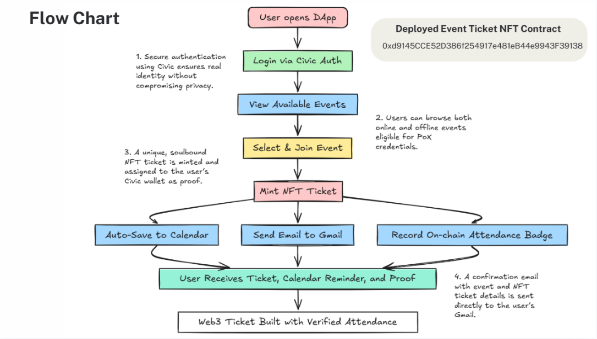

# Proof of Experience (PoX): Verifiable Event Credentials for the Web3 Era

##  Overview

**PoX** is a decentralized application that turns every event you attend into a **verifiable on-chain credential** — no wallet, no friction. Powered by [Civic Auth](https://www.civic.com/), it bridges Web2 and Web3 by minting soulbound NFT tickets, syncing events to your Google Calendar, and sending proof directly to your Gmail.

---

##  Problem

- No verifiable credentials for attended events  
- Reliance on screenshots, QR codes, or centralized emails  
- Poor interoperability between Web2 tools and Web3 identity  
- Lack of on-chain recognition for real-world experience  
- Wallet onboarding complexity for non-crypto users  

---

##  Solution

PoX solves this by:
- Enabling **Civic Auth login** (no seed phrases or MetaMask)
- Creating **embedded wallets**
- Minting **soulbound NFT tickets**
- **Auto-saving events** to your **Google Calendar**
- **Emailing proof** with transaction details to **Gmail**
- Storing a permanent **on-chain experience badge**

---

##  Features

- ** Civic Auth Integration**  
  Frictionless login without wallets or extensions.
  
- ** NFT Ticket Minting**  
  Tamper-proof, soulbound NFT credentials on-chain.

- ** Calendar Auto-Sync**  
  Automatically adds events to the user’s Google Calendar.

- ** Gmail Proof Delivery**  
  Mints NFT → sends metadata and tx hash to Gmail instantly.

- ** On-Chain Experience Badges**  
  Web3-native resume for real and virtual participation.

- ** No Wallet Required**  
  Embedded wallet experience for everyone — crypto-savvy or not.

---

##  Architecture Flow

---

##  Tech Stack

- **Frontend**: Next.js, TypeScript, Tailwind CSS  
- **Auth & Wallets**: `@civic/auth-web3`  
- **Calendar Sync**: Google Calendar API  
- **Email**: Resend API  (To get: https://resend.com/api-keys)
- **Smart Contract**: Solidity (EVM compatible)  
- **Contract Address**: [`0xd9145CCE52D386f254917e481eB44e9943F39138`](https://etherscan.io/address/0xd9145CCE52D386f254917e481eB44e9943F39138)

---

##  Local Setup Instructions

### 1. Clone the Repository

git clone https://github.com/YOUR_USERNAME/poxwallet.git

cd poxwallet

### 2. Create .env.local File

NEXT_PUBLIC_CLIENT_ID=<your_civic_client_id>

RESEND_API_KEY=<your_resend_api_key>

NEXT_PUBLIC_GOOGLE_CLIENT_ID=<your_google_client_id>

### 3. Install Dependencies

yarn

### 4. Run Locally

yarn dev